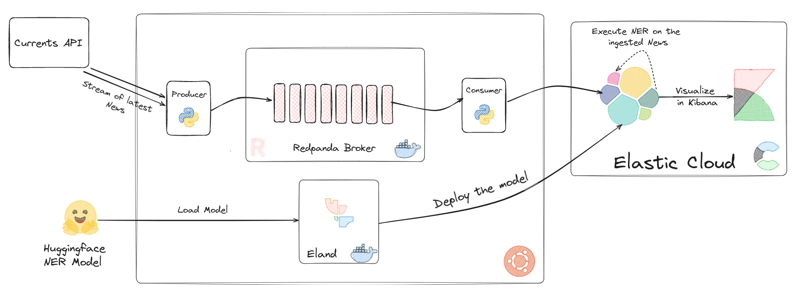
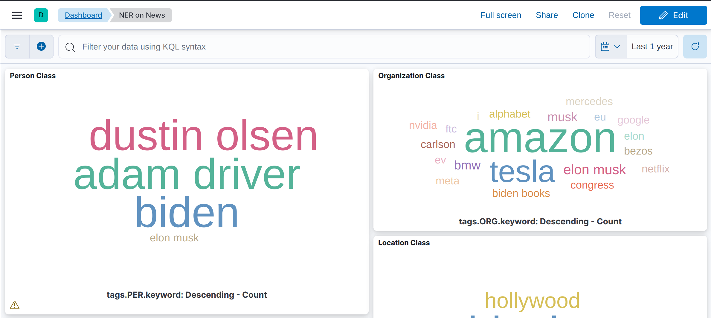
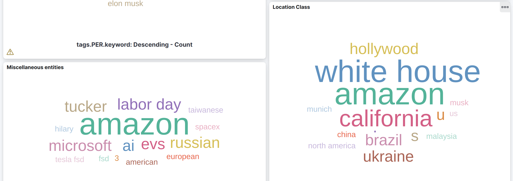

# Real-Time-News-Article-Analysis-with-NER

Description: In this project, I created a real-time data processing pipeline that ingests news articles, extracts named entities (e.g., organizations, people, locations), and performs analytics on the extracted information. The project showcases some skills in data engineering, real-time streaming, NER, and distributed computing.

Key Components:

## Data Ingestion: 
News articles are collected in real-time using [Currents API](https://currentsapi.services/en).

## Named Entity Recognition (NER):

A [NER model from hugginface](https://huggingface.co/elastic/distilbert-base-uncased-finetuned-conll03-english) is loaded using [Eland](https://www.elastic.co/guide/en/elasticsearch/client/eland/current/index.html) to Elastic Cloud where it will be deployed and used when ingesting news to detect entities showing in the news articles.

## Real-Time Data Streaming and Processing:

Integrate Redpanda with the data ingestion layer to handle the incoming news articles stream.

## Analytics and Insights:

The news articles are consumed by a python script from Redpanda and sent to elastic cluster deployed using elastic Cloud. In the Elasticsearch an ingest pipeline is used to transform the documents and call the NER model on the title field (or any other field we want). Then the transformed documents or articles are stored in Elasticsearch.

## Data Visualization:

Kibana is used to create a simple dashboard showing the detected entities.(keeping it simple)

